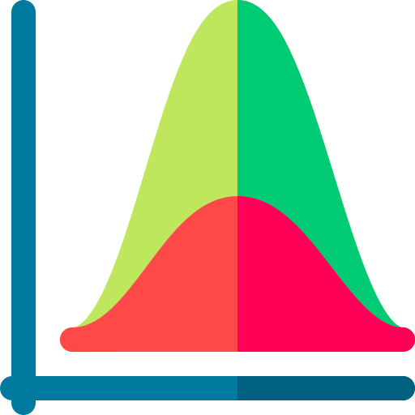

  
     
  
    
  
  
  
  
  
  
    
  
    

<h1 align="center"> GitHub Stats </h1>

  
    
  
  
  
  
  
  
  
  
  

<h1 align="center"> Tools I Use </h1>

   
  <table align='center'>
    <tr>
      <td align='center'></td>
      <td align='center'></td>
      <td align='center'></td>
      <td align='center'></td>
      <td align='center'></td>
      <td align='center'></td>
    </tr>
    <tr>
      <td align='center'></td>
      <td align='center'></td>
      <td align='center'></td>
      <td align='center'></td>
      <td align='center'></td>
      <td align='center'></td>
    </tr>
    <tr>
      <td></td>
      <td align='center'></td>
      <td align='center'></td>
      <td align='center'></td>
      <td align='center'></td>
      <td></td>
    </tr>
  </table>
   

<h1 align="center"> Gallery </h1>

  <a href="https://photos.app.goo.gl/E48FPSpDRT3BQ6Px6">
    
     
    
  </a>
  
  

